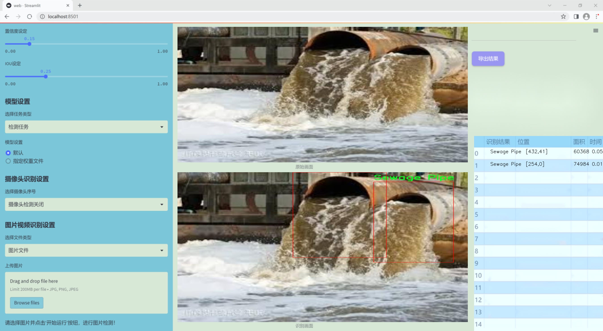
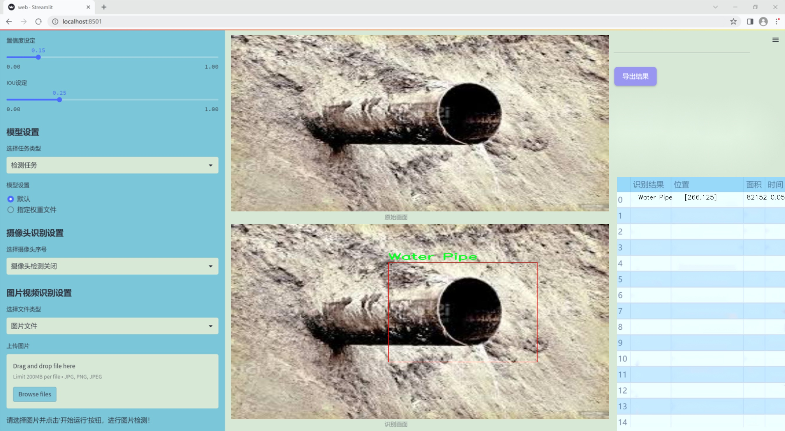
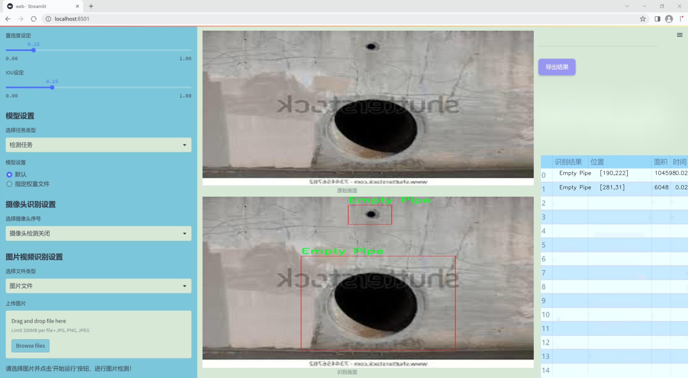
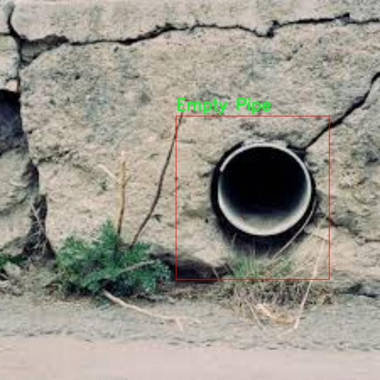
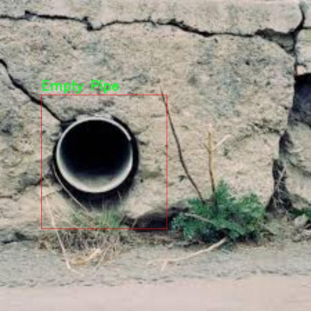
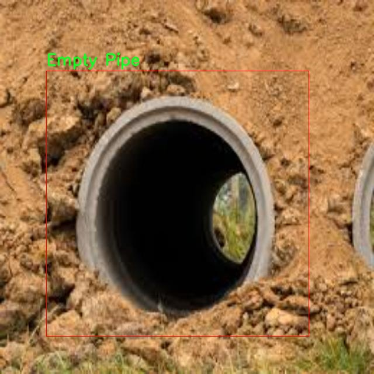
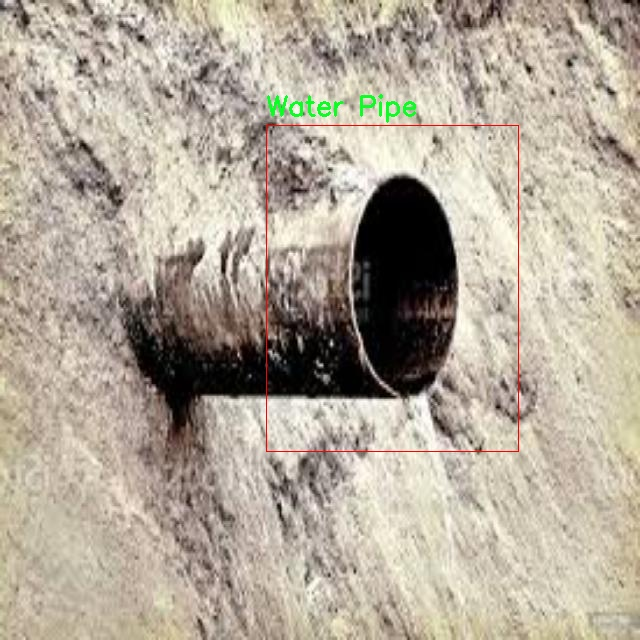
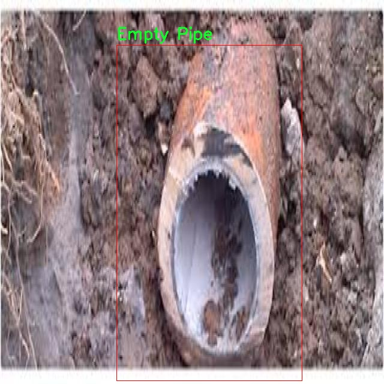

### 1.背景意义

研究背景与意义

随着城市化进程的加快，污水和清水管道的管理与监测变得愈发重要。污水管道的有效管理不仅关系到城市环境的卫生和居民的生活质量，还直接影响到水资源的可持续利用。近年来，污染排放检测技术的发展为管道类型的自动识别提供了新的可能性，尤其是在智能城市建设和环境监测领域。传统的管道检测方法往往依赖人工检查，效率低下且容易受到人为因素的影响。因此，基于计算机视觉的自动化识别系统应运而生，成为提升管道管理效率的重要工具。

本研究旨在开发一个基于改进YOLOv11的污水管道与清水管道类型识别系统。该系统利用深度学习技术，能够快速、准确地识别管道类型，从而为后续的污染排放检测提供数据支持。数据集包含三种管道类型：空管道、污水管道和清水管道，共116幅经过精细标注的图像。这些图像经过了预处理和增强，确保了模型训练的多样性和鲁棒性。通过对这些图像的分析，系统能够学习到不同管道类型的特征，从而实现高效的分类和识别。

在当前的环境保护和资源管理背景下，构建这样一个智能识别系统具有重要的现实意义。它不仅能够提高管道检测的自动化水平，降低人工成本，还能为环境监测提供实时数据支持，助力政府和相关部门进行科学决策。此外，该系统的成功应用将为其他领域的计算机视觉技术推广提供借鉴，推动智能技术在环境保护中的广泛应用。因此，本研究不仅具有学术价值，也具备广泛的社会应用前景。

### 2.视频效果

[2.1 视频效果](https://www.bilibili.com/video/BV1jBBeY8Enp/)

### 3.图片效果







##### [项目涉及的源码数据来源链接](https://kdocs.cn/l/cszuIiCKVNis)**

注意：本项目提供训练的数据集和训练教程,由于版本持续更新,暂不提供权重文件（best.pt）,请按照6.训练教程进行训练后实现上图演示的效果。

### 4.数据集信息

##### 4.1 本项目数据集类别数＆类别名

nc: 3
names: ['Empty Pipe', 'Sewage Pipe', 'Water Pipe']


该项目为【目标检测】数据集，请在【训练教程和Web端加载模型教程（第三步）】这一步的时候按照【目标检测】部分的教程来训练

##### 4.2 本项目数据集信息介绍

本项目数据集信息介绍

本项目旨在开发一个改进版的YOLOv11模型，以实现对污水管道和清水管道的高效识别，特别关注污染排放检测的应用。为此，我们构建了一个专门的数据集，涵盖了与管道相关的多种类型，旨在为模型的训练提供丰富而多样的样本。该数据集共包含三种主要类别，分别是“Empty Pipe”（空管道）、“Sewage Pipe”（污水管道）和“Water Pipe”（清水管道）。这些类别的选择不仅反映了管道系统的基本构成，也为模型在实际应用中提供了重要的区分依据。

在数据集的构建过程中，我们注重数据的多样性和代表性，确保每一类管道都有足够的样本来支持模型的学习。空管道的样本展示了管道在没有流体的情况下的特征，帮助模型理解管道的基本形态；污水管道的样本则包含了多种污水流动状态下的图像，反映了不同污染物对管道外观的影响；而清水管道的样本则强调了管道在正常工作状态下的表现。这种多样化的样本选择，使得模型能够在不同的环境和条件下进行有效的识别。

此外，数据集的图像质量和标注准确性也得到了严格把控，确保每个样本都经过专业的标注，以便于模型的训练和评估。通过使用这一数据集，我们期望能够显著提升YOLOv11在管道类型识别中的准确性和鲁棒性，从而为污染排放检测提供更加可靠的技术支持。这一研究不仅具有重要的学术价值，也对实际的环境监测和管理具有深远的意义。











### 5.全套项目环境部署视频教程（零基础手把手教学）

[5.1 所需软件PyCharm和Anaconda安装教程（第一步）](https://www.bilibili.com/video/BV1BoC1YCEKi/?spm_id_from=333.999.0.0&vd_source=bc9aec86d164b67a7004b996143742dc)


[5.2 安装Python虚拟环境创建和依赖库安装视频教程（第二步）](https://www.bilibili.com/video/BV1ZoC1YCEBw?spm_id_from=333.788.videopod.sections&vd_source=bc9aec86d164b67a7004b996143742dc)

### 6.改进YOLOv11训练教程和Web_UI前端加载模型教程（零基础手把手教学）

[6.1 改进YOLOv11训练教程和Web_UI前端加载模型教程（第三步）](https://www.bilibili.com/video/BV1BoC1YCEhR?spm_id_from=333.788.videopod.sections&vd_source=bc9aec86d164b67a7004b996143742dc)


按照上面的训练视频教程链接加载项目提供的数据集，运行train.py即可开始训练



     Epoch   gpu_mem       box       obj       cls    labels  img_size
     1/200     20.8G   0.01576   0.01955  0.007536        22      1280: 100%|██████████| 849/849 [14:42<00:00,  1.04s/it]
               Class     Images     Labels          P          R     mAP@.5 mAP@.5:.95: 100%|██████████| 213/213 [01:14<00:00,  2.87it/s]
                 all       3395      17314      0.994      0.957      0.0957      0.0843

     Epoch   gpu_mem       box       obj       cls    labels  img_size
     2/200     20.8G   0.01578   0.01923  0.007006        22      1280: 100%|██████████| 849/849 [14:44<00:00,  1.04s/it]
               Class     Images     Labels          P          R     mAP@.5 mAP@.5:.95: 100%|██████████| 213/213 [01:12<00:00,  2.95it/s]
                 all       3395      17314      0.996      0.956      0.0957      0.0845

     Epoch   gpu_mem       box       obj       cls    labels  img_size
     3/200     20.8G   0.01561    0.0191  0.006895        27      1280: 100%|██████████| 849/849 [10:56<00:00,  1.29it/s]
               Class     Images     Labels          P          R     mAP@.5 mAP@.5:.95: 100%|███████   | 187/213 [00:52<00:00,  4.04it/s]
                 all       3395      17314      0.996      0.957      0.0957      0.0845


###### [项目数据集下载链接](https://kdocs.cn/l/cszuIiCKVNis)

### 7.原始YOLOv11算法讲解


##### YOLOv11三大损失函数

YOLOv11（You Only Look Once）是一种流行的目标检测算法，其损失函数设计用于同时优化分类和定位任务。YOLO的损失函数通常包括几个部分：
**分类损失、定位损失（边界框回归损失）和置信度损失** 。其中，

  1. box_loss（边界框回归损失）是用于优化预测边界框与真实边界框之间的差异的部分。

  2. cls_loss（分类损失）是用于优化模型对目标类别的预测准确性的部分。分类损失确保模型能够正确地识别出图像中的对象属于哪个类别。

  3. dfl_loss（Distribution Focal Loss）是YOLO系列中的一种损失函数，特别是在一些改进版本如YOLOv5和YOLOv7中被引入。它的主要目的是解决目标检测中的类别不平衡问题，并提高模型在处理小目标和困难样本时的性能。

##### 边界框回归损失详解

box_loss（边界框回归损失）是用于优化预测边界框与真实边界框之间的差异的部分。


##### box_loss 的具体意义


##### 为什么需要 box_loss

  * 精确定位：通过最小化中心点坐标损失和宽高损失，模型能够更准确地预测目标的位置和大小。
  * 平衡不同类型的目标：使用平方根来处理宽高损失，可以更好地平衡不同大小的目标，确保小目标也能得到足够的关注。
  * 稳定训练：适当的损失函数设计有助于模型的稳定训练，避免梯度爆炸或消失等问题。

##### 分类损失详解

在YOLO（You Only Look
Once）目标检测算法中，cls_loss（分类损失）是用于优化模型对目标类别的预测准确性的部分。分类损失确保模型能够正确地识别出图像中的对象属于哪个类别。下面是关于cls_loss的详细解读：

##### 分类损失 (cls_loss) 的具体意义

  
分类损失通常使用交叉熵损失（Cross-Entropy
Loss）来计算。交叉熵损失衡量的是模型预测的概率分布与真实标签之间的差异。在YOLO中，分类损失的具体形式如下：


##### 为什么需要 cls_loss

  * 类别识别：cls_loss 确保模型能够正确识别出图像中的目标属于哪个类别。这对于目标检测任务至关重要，因为不仅需要知道目标的位置，还需要知道目标的类型。

  * 多类别支持：通过最小化分类损失，模型可以处理多个类别的目标检测任务。例如，在道路缺陷检测中，可能需要识别裂缝、坑洞、路面破损等多种类型的缺陷。

  * 提高准确性：分类损失有助于提高模型的分类准确性，从而提升整体检测性能。通过优化分类损失，模型可以更好地学习不同类别之间的特征差异。

##### 分布损失详解

`dfl_loss`（Distribution Focal
Loss）是YOLO系列中的一种损失函数，特别是在一些改进版本如YOLOv5和YOLOv7中被引入。它的主要目的是解决目标检测中的类别不平衡问题，并提高模型在处理小目标和困难样本时的性能。下面是对`dfl_loss`的详细解读：

##### DFL Loss 的背景

在目标检测任务中，类别不平衡是一个常见的问题。某些类别的样本数量可能远远多于其他类别，这会导致模型在训练过程中对常见类别的学习效果较好，而对罕见类别的学习效果较差。此外，小目标和困难样本的检测也是一个挑战，因为这些目标通常具有较少的特征信息，容易被忽略或误分类。

为了应对这些问题，研究者们提出了多种改进方法，其中之一就是`dfl_loss`。`dfl_loss`通过引入分布焦点损失来增强模型对困难样本的关注，并改善类别不平衡问题。

##### DFL Loss 的定义

DFL Loss
通常与传统的交叉熵损失结合使用，以增强模型对困难样本的学习能力。其核心思想是通过对每个类别的预测概率进行加权，使得模型更加关注那些难以正确分类的样本。

DFL Loss 的公式可以表示为：


##### DFL Loss 的具体意义**

  * **类别不平衡：** 通过引入平衡因子 α，DFL Loss 可以更好地处理类别不平衡问题。对于少数类别的样本，可以通过增加其权重来提升其重要性，从而提高模型对这些类别的检测性能。
  *  **困难样本：** 通过聚焦参数 γ，DFL Loss 可以让模型更加关注那些难以正确分类的样本。当 
  * γ 较大时，模型会对那些预测概率较低的样本给予更多的关注，从而提高这些样本的分类准确性。
  *  **提高整体性能** ：DFL Loss 结合了传统交叉熵损失的优势，并通过加权机制增强了模型对困难样本的学习能力，从而提高了整体的检测性能。


### 8.200+种全套改进YOLOV11创新点原理讲解

#### 8.1 200+种全套改进YOLOV11创新点原理讲解大全

由于篇幅限制，每个创新点的具体原理讲解就不全部展开，具体见下列网址中的改进模块对应项目的技术原理博客网址【Blog】（创新点均为模块化搭建，原理适配YOLOv5~YOLOv11等各种版本）

[改进模块技术原理博客【Blog】网址链接](https://gitee.com/qunmasj/good)


#### 8.2 精选部分改进YOLOV11创新点原理讲解

###### 这里节选部分改进创新点展开原理讲解(完整的改进原理见上图和[改进模块技术原理博客链接](https://gitee.com/qunmasj/good)【如果此小节的图加载失败可以通过CSDN或者Github搜索该博客的标题访问原始博客，原始博客图片显示正常】


### D-LKA Attention简介
自2010年代中期以来，卷积神经网络（CNNs）已成为许多计算机视觉应用的首选技术。它们能够从原始数据中自动提取复杂的特征表示，无需手动进行特征工程，这引起了医学图像分析社区的极大兴趣。许多成功的CNN架构，如U-Net、全卷积网络、DeepLab或SegCaps（分割胶囊），已经被开发出来。这些架构在语义分割任务中取得了巨大成功，先前的最新方法已经被超越。

在计算机视觉研究中，不同尺度下的目标识别是一个关键问题。在CNN中，可检测目标的大小与相应网络层的感受野尺寸密切相关。如果一个目标扩展到超出这个感受野的边界，这可能会导致欠分割结果。相反，与目标实际大小相比使用过大的感受野可能会限制识别，因为背景信息可能会对预测产生不必要的影响。

解决这个问题的一个有希望的方法涉及在并行使用具有不同尺寸的多个Kernel，类似于Inception块的机制。然而，由于参数和计算要求的指数增长，将Kernel大小增加以容纳更大的目标在实践中受到限制。因此，出现了各种策略，包括金字塔池化技术和不同尺度的扩张卷积，以捕获多尺度的上下文信息。

另一个直观的概念涉及将多尺度图像金字塔或它们的相关特征表示直接纳入网络架构。然而，这种方法存在挑战，特别是在管理训练和推理时间方面的可行性方面存在挑战。在这个背景下，使用编码器-解码器网络，如U-Net，已被证明是有利的。这样的网络在较浅的层中编码外观和位置，而在更深的层中，通过神经元的更广泛的感受野捕获更高的语义信息和上下文信息。

一些方法将来自不同层的特征组合在一起，或者预测来自不同尺寸的层的特征以使用多尺度的信息。此外，出现了从不同尺度的层中预测特征的方法，有效地实现了跨多个尺度的见解整合。然而，大多数编码器-解码器结构面临一个挑战：它们经常无法在不同尺度之间保持一致的特征，并主要使用最后一个解码器层生成分割结果。

语义分割是一项任务，涉及根据预定义的标签集为图像中的每个像素预测语义类别。这项任务要求提取高级特征同时保留初始的空间分辨率。CNNs非常适合捕获局部细节和低级信息，尽管以忽略全局上下文为代价。视觉Transformer（ViT）架构已经成为解决处理全局信息的视觉任务的关键，包括语义分割，取得了显著的成功。

ViT的基础是注意力机制，它有助于在整个输入序列上聚合信息。这种能力使网络能够合并远程的上下文提示，超越了CNN的有限感受野尺寸。然而，这种策略通常会限制ViT有效建模局部信息的能力。这种局限可能会妨碍它们检测局部纹理的能力，这对于各种诊断和预测任务至关重要。这种缺乏局部表示可以归因于ViT模型处理图像的特定方式。

ViT模型将图像分成一系列Patch，并使用自注意力机制来模拟它们之间的依赖关系。这种方法可能不如CNN模型中的卷积操作对感受野内提取局部特征有效。ViT和CNN模型之间的这种图像处理方法的差异可能解释了CNN模型在局部特征提取方面表现出色的原因。

近年来，已经开发出创新性方法来解决Transformer模型内部局部纹理不足的问题。其中一种方法是通过互补方法将CNN和ViT特征结合起来，以结合它们的优势并减轻局部表示的不足。TransUNet是这种方法的早期示例，它在CNN的瓶颈中集成了Transformer层，以模拟局部和全局依赖关系。HiFormer提出了一种解决方案，将Swin Transformer模块和基于CNN的编码器结合起来，生成两个多尺度特征表示，通过Double-Level Fusion模块集成。UNETR使用基于Transformer的编码器和CNN解码器进行3D医学图像分割。CoTr和TransBTS通过Transformer在低分辨率阶段增强分割性能，将CNN编码器和解码器连接在一起。

增强局部特征表示的另一种策略是重新设计纯Transformer模型内部的自注意力机制。在这方面，Swin-Unet在U形结构中集成了一个具有线性计算复杂性的Swin Transformer块作为多尺度 Backbone 。MISSFormer采用高效Transformer来解决视觉Transformer中的参数问题，通过在输入块上进行不可逆的降采样操作。D-Former引入了一个纯Transformer的管道，具有双重注意模块，以分段的方式捕获细粒度的局部注意和与多元单元的交互。然而，仍然存在一些特定的限制，包括计算效率低下，如TransUNet模型所示，对CNN Backbone 的严重依赖，如HiFormer所观察到的，以及对多尺度信息的忽略。

此外，目前的分割架构通常采用逐层处理3D输入 volumetric 的方法，无意中忽视了相邻切片之间的潜在相关性。这一疏忽限制了对 volumetric 信息的全面利用，因此损害了定位精度和上下文集成。此外，必须认识到，医学领域的病变通常在形状上发生变形。因此，用于医学图像分析的任何学习算法都必须具备捕捉和理解这些变形的能力。与此同时，该算法应保持计算效率，以便处理3D volumetric数据。

为了解决上述提到的挑战，作者提出了一个解决方案，即可变形大卷积核注意力模块（Deformable LKA module），它是作者网络设计的基本构建模块。这个模块明确设计成在有效处理上下文信息的同时保留局部描述符。作者的架构在这两个方面的平衡增强了实现精确语义分割的能力。

值得注意的是，参考该博客引入了一种基于数据的感受野的动态适应，不同于传统卷积操作中的固定滤波器Mask。这种自适应方法使作者能够克服与静态方法相关的固有限制。这种创新方法还扩展到了D-LKA Net架构的2D和3D版本的开发。

在3D模型的情况下，D-LKA机制被量身定制以适应3D环境，从而实现在不同 volumetric 切片之间无缝信息交互。最后，作者的贡献通过其计算效率得到进一步强调。作者通过仅依靠D-LKA概念的设计来实现这一点，在各种分割基准上取得了显著的性能，确立了作者的方法作为一种新的SOTA方法。

在本节中，作者首先概述方法论。首先，作者回顾了由Guo等人引入的大卷积核注意力（Large Kernel Attention，LKA）的概念。然后，作者介绍了作者对可变形LKA模块的创新探索。在此基础上，作者介绍了用于分割任务的2D和3D网络架构。

大卷积核提供了与自注意力机制类似的感受野。可以通过使用深度卷积、深度可扩展卷积和卷积来构建大卷积核，从而减少了参数和计算量。构建输入维度为和通道数的卷积核的深度卷积和深度可扩展卷积的卷积核大小的方程如下：


具有卷积核大小和膨胀率。参数数量和浮点运算（FLOPs）的计算如下：


FLOPs的数量与输入图像的大小成线性增长。参数的数量随通道数和卷积核大小的增加而呈二次增长。然而，由于它们通常都很小，因此它们不是限制因素。

为了最小化对于固定卷积核大小K的参数数量，可以将方程3对于膨胀率的导数设定为零：


例如，当卷积核大小为时，结果是。将这些公式扩展到3D情况是直接的。对于大小为和通道数C的输入，3D情况下参数数量和FLOPs 的方程如下：


具有卷积核大小和膨胀。


利用大卷积核进行医学图像分割的概念通过引入可变形卷积得以扩展。可变形卷积可以通过整数偏移自由调整采样网格以进行自由变形。额外的卷积层从特征图中学习出变形，从而创建一个偏移场。基于特征本身学习变形会导致自适应卷积核。这种灵活的卷积核形状可以提高病变或器官变形的表示，从而增强了目标边界的定义。

负责计算偏移的卷积层遵循其相应卷积层的卷积核大小和膨胀。双线性插值用于计算不在图像网格上的偏移的像素值。如图2所示，D-LKA模块可以表示为：


其中输入特征由表示，。表示为注意力图，其中每个值表示相应特征的相对重要性。运算符  表示逐元素乘法运算。值得注意的是，LKA不同于传统的注意力方法，它不需要额外的规范化函数，如或。这些规范化函数往往忽视高频信息，从而降低了基于自注意力的方法的性能。

在该方法的2D版本中，卷积层被可变形卷积所替代，因为可变形卷积能够改善对具有不规则形状和大小的目标的捕捉能力。这些目标在医学图像数据中常常出现，因此这种增强尤为重要。

然而，将可变形LKA的概念扩展到3D领域会带来一定的挑战。主要的约束来自于需要用于生成偏移的额外卷积层。与2D情况不同，由于输入和输出通道的性质，这一层无法以深度可分的方式执行。在3D环境中，输入通道对应于特征，而输出通道扩展到，其中是卷积核的大小。大卷积核的复杂性导致沿第3D的通道数扩展，导致参数和FLOPs大幅增加。因此，针对3D情况采用了另一种替代方法。在现有的LKA框架中，深度卷积之后引入了一个单独的可变形卷积层。这种战略性的设计调整旨在减轻扩展到3D领域所带来的挑战。


2D网络的架构如图1所示。第一变种使用MaxViT作为编码器组件，用于高效特征提取，而第二变种则结合可变形LKA层进行更精细、卓越的分割。

在更正式的描述中，编码器生成4个分层输出表示。首先，卷积干扰将输入图像的维度减小到。随后，通过4个MaxViT块的4个阶段进行特征提取，每个阶段后跟随降采样层。随着过程进展到解码器，实施了4个阶段的D-LKA层，每个阶段包含2个D-LKA块。然后，应用Patch扩展层以实现分辨率上采样，同时减小通道维度。最后，线性层负责生成最终的输出。

2D D-LKA块的结构包括LayerNorm、可变形LKA和多层感知器（MLP）。积分残差连接确保了有效的特征传播，即使在更深层也是如此。这个安排可以用数学方式表示为：


其中输入特征，层归一化LN，可变形LKA注意力，深度卷积，线性层和GeLU激活函数。

3D网络架构如图1所示，采用编码器-解码器设计进行分层结构化。首先，一个Patch嵌入层将输入图像的维度从（）减小到（）。在编码器中，采用了3个D-LKA阶段的序列，每个阶段包含3个D-LKA块。在每个阶段之后，通过降采样步骤将空间分辨率减半，同时将通道维度加倍。中央瓶颈包括另一组2个D-LKA块。解码器结构与编码器相对称。

为了将特征分辨率加倍，同时减少通道数，使用转置卷积。每个解码器阶段都使用3个D-LKA块来促进远距离特征依赖性。最终的分割输出由一个卷积层产生，后面跟随一个卷积层以匹配特定类别的通道要求。

为了建立输入图像和分割输出之间的直接连接，使用卷积形成了一个跳跃连接。额外的跳跃连接根据简单的加法对来自其他阶段的特征进行融合。最终的分割图是通过和卷积层的组合产生的。

3D D-LKA块包括层归一化，后跟D-LKA注意力，应用了残差连接的部分。随后的部分采用了一个卷积层，后面跟随一个卷积层，两者都伴随着残差连接。这个整个过程可以总结如下：


带有输入特征 、层归一化 、可变形 LKA 、卷积层 和输出特征 的公式。是指一个前馈网络，包括2个卷积层和激活函数。

表7显示了普通卷积和构建卷积的参数数量比较。尽管标准卷积的参数数量在通道数较多时急剧增加，但分解卷积的参数总体较低，并且增长速度不那么快。

与分解卷积相比，可变形分解卷积增加了大量参数，但仍然明显小于标准卷积。可变形卷积的主要参数是由偏移网络创建的。在这里，作者假设可变形深度卷积的Kernel大小为（5,5），可变形深度空洞卷积的Kernel大小为（7,7）。这导致了21×21大小的大Kernel的最佳参数数量。更高效地生成偏移量的方法将大大减少参数数量。


值得注意的是，引入可变形LKA确实会增加模型的参数数量和每秒的浮点运算次数（FLOPS）。然而，重要的是强调，这增加的计算负载不会影响作者模型的整体推理速度。

相反，对于Batch-size > 1，作者甚至观察到推理时间的减少，如图7所示。例如，基于作者的广泛实验，作者观察到对于Batch-size为16，具有可变形卷积和没有可变形卷积的推理时间分别为8.01毫秒和17.38毫秒。作者认为这是由于在2D中对可变形卷积的高效实现所致。为了测量时间，使用了大小为（）的随机输入。在GPU热身周期50次迭代之后，网络被推断了1000次。测量是在NVIDIA RTX 3090 GPU上进行的。


为了充分利用性能与参数之间的权衡关系，作者在图8中可视化了在Synapse 2D数据集上报告的DSC和HD性能以及基于参数数量的内存消耗。D-LKA Net引入了相当多的参数，约为101M。这比性能第二好的方法ScaleFormer使用的111.6M参数要少。

与更轻量级的DAEFormer模型相比，作者实现了更好的性能，这证明了参数增加的合理性。大多数参数来自于MaxViT编码器；因此，将编码器替换为更高效的编码器可以减少模型参数。值得注意的是，在此可视化中，作者最初将HD和内存值都归一化到[0, 100]范围内。随后，作者将它们从100缩小，以增强更高值的表示。


### 9.系统功能展示

图9.1.系统支持检测结果表格显示

  图9.2.系统支持置信度和IOU阈值手动调节

  图9.3.系统支持自定义加载权重文件best.pt(需要你通过步骤5中训练获得)

  图9.4.系统支持摄像头实时识别

  图9.5.系统支持图片识别

  图9.6.系统支持视频识别

  图9.7.系统支持识别结果文件自动保存

  图9.8.系统支持Excel导出检测结果数据


### 10. YOLOv11核心改进源码讲解

#### 10.1 starnet.py

以下是对给定代码的核心部分进行分析和详细注释的结果：

```python
import torch
import torch.nn as nn
from timm.models.layers import DropPath, trunc_normal_

class ConvBN(torch.nn.Sequential):
    """
    结合卷积层和批归一化层的模块。
    """
    def __init__(self, in_planes, out_planes, kernel_size=1, stride=1, padding=0, dilation=1, groups=1, with_bn=True):
        super().__init__()
        # 添加卷积层
        self.add_module('conv', torch.nn.Conv2d(in_planes, out_planes, kernel_size, stride, padding, dilation, groups))
        # 如果需要，添加批归一化层
        if with_bn:
            self.add_module('bn', torch.nn.BatchNorm2d(out_planes))
            # 初始化批归一化层的权重和偏置
            torch.nn.init.constant_(self.bn.weight, 1)
            torch.nn.init.constant_(self.bn.bias, 0)

class Block(nn.Module):
    """
    StarNet中的基本构建块，包含深度卷积和MLP结构。
    """
    def __init__(self, dim, mlp_ratio=3, drop_path=0.):
        super().__init__()
        # 深度卷积层
        self.dwconv = ConvBN(dim, dim, 7, 1, (7 - 1) // 2, groups=dim, with_bn=True)
        # MLP的两个卷积层
        self.f1 = ConvBN(dim, mlp_ratio * dim, 1, with_bn=False)
        self.f2 = ConvBN(dim, mlp_ratio * dim, 1, with_bn=False)
        # MLP的输出卷积层
        self.g = ConvBN(mlp_ratio * dim, dim, 1, with_bn=True)
        # 第二个深度卷积层
        self.dwconv2 = ConvBN(dim, dim, 7, 1, (7 - 1) // 2, groups=dim, with_bn=False)
        self.act = nn.ReLU6()  # 激活函数
        self.drop_path = DropPath(drop_path) if drop_path > 0. else nn.Identity()  # 随机深度

    def forward(self, x):
        input = x  # 保存输入以便后续残差连接
        x = self.dwconv(x)  # 通过深度卷积层
        x1, x2 = self.f1(x), self.f2(x)  # 通过两个MLP卷积层
        x = self.act(x1) * x2  # 元素级乘法
        x = self.dwconv2(self.g(x))  # 通过输出卷积层
        x = input + self.drop_path(x)  # 残差连接
        return x

class StarNet(nn.Module):
    """
    StarNet网络结构。
    """
    def __init__(self, base_dim=32, depths=[3, 3, 12, 5], mlp_ratio=4, drop_path_rate=0.0, num_classes=1000, **kwargs):
        super().__init__()
        self.num_classes = num_classes
        self.in_channel = 32
        # stem层，初始卷积层
        self.stem = nn.Sequential(ConvBN(3, self.in_channel, kernel_size=3, stride=2, padding=1), nn.ReLU6())
        dpr = [x.item() for x in torch.linspace(0, drop_path_rate, sum(depths))]  # 随机深度
        # 构建网络的各个阶段
        self.stages = nn.ModuleList()
        cur = 0
        for i_layer in range(len(depths)):
            embed_dim = base_dim * 2 ** i_layer  # 当前阶段的嵌入维度
            down_sampler = ConvBN(self.in_channel, embed_dim, 3, 2, 1)  # 下采样层
            self.in_channel = embed_dim
            blocks = [Block(self.in_channel, mlp_ratio, dpr[cur + i]) for i in range(depths[i_layer])]  # 构建Block
            cur += depths[i_layer]
            self.stages.append(nn.Sequential(down_sampler, *blocks))  # 将下采样层和Block组合

    def forward(self, x):
        features = []  # 存储特征
        x = self.stem(x)  # 通过stem层
        features.append(x)
        for stage in self.stages:
            x = stage(x)  # 通过每个阶段
            features.append(x)
        return features  # 返回所有阶段的特征

# 创建不同版本的StarNet模型
def starnet_s1(pretrained=False, **kwargs):
    model = StarNet(24, [2, 2, 8, 3], **kwargs)
    return model

def starnet_s2(pretrained=False, **kwargs):
    model = StarNet(32, [1, 2, 6, 2], **kwargs)
    return model

def starnet_s3(pretrained=False, **kwargs):
    model = StarNet(32, [2, 2, 8, 4], **kwargs)
    return model

def starnet_s4(pretrained=False, **kwargs):
    model = StarNet(32, [3, 3, 12, 5], **kwargs)
    return model
```

### 代码核心部分说明：
1. **ConvBN 类**：将卷积层和批归一化层组合在一起，便于使用。
2. **Block 类**：StarNet的基本构建块，包含深度卷积、MLP和残差连接。
3. **StarNet 类**：整个网络结构，包含stem层和多个阶段，每个阶段由下采样和多个Block组成。
4. **模型创建函数**：提供了不同版本的StarNet模型的创建方式，方便使用。

这些核心部分构成了StarNet的基础结构，体现了其设计理念和功能。

该文件实现了一个名为StarNet的深度学习网络模型，主要用于图像处理任务。StarNet的设计理念是尽量简化网络结构，以突出元素级乘法的关键贡献。文件中包含了网络的各个组件和构建方法。

首先，文件引入了必要的库，包括PyTorch和一些特定的层模块。接着，定义了一个字典`model_urls`，用于存储不同版本StarNet模型的预训练权重下载链接。

在实现上，文件定义了几个类。`ConvBN`类是一个简单的卷积层和批归一化层的组合，允许用户选择是否使用批归一化。它在初始化时会创建卷积层，并根据需要添加批归一化层，同时初始化权重和偏置。

`Block`类是StarNet的基本构建块。它包含了深度可分离卷积、两个线性变换（通过`ConvBN`实现）和一个元素级乘法操作。该类还使用了ReLU6激活函数和随机丢弃路径（DropPath）机制，后者在训练过程中可以随机丢弃某些路径以增强模型的泛化能力。

`StarNet`类是整个网络的主体。它的构造函数中定义了网络的输入通道、各个阶段的深度和其他参数。网络的初始部分是一个stem层，后面是多个阶段，每个阶段由下采样层和多个`Block`组成。通过这种结构，网络能够逐步提取特征并降低空间维度。网络的前向传播方法返回了每个阶段的特征。

此外，文件还定义了多个函数，如`starnet_s1`到`starnet_s4`，这些函数用于创建不同规模的StarNet模型，并提供了加载预训练权重的选项。这些函数的参数可以灵活调整，以适应不同的任务需求。

最后，文件还提供了三个非常小的网络版本（`starnet_s050`、`starnet_s100`、`starnet_s150`），适用于资源受限的环境或快速实验。

总的来说，该文件实现了一个灵活且高效的深度学习网络，适合于各种图像处理任务，并且提供了预训练模型的下载链接，方便用户直接使用。

#### 10.2 activation.py

```python
import torch
import torch.nn as nn

class AGLU(nn.Module):
    """AGLU激活函数模块，来自https://github.com/kostas1515/AGLU。"""

    def __init__(self, device=None, dtype=None) -> None:
        """初始化AGLU激活函数模块。"""
        super().__init__()
        # 使用Softplus作为基础激活函数，beta设置为-1.0
        self.act = nn.Softplus(beta=-1.0)
        # 初始化lambda参数，确保其在指定设备和数据类型上
        self.lambd = nn.Parameter(nn.init.uniform_(torch.empty(1, device=device, dtype=dtype)))  # lambda参数
        # 初始化kappa参数，确保其在指定设备和数据类型上
        self.kappa = nn.Parameter(nn.init.uniform_(torch.empty(1, device=device, dtype=dtype)))  # kappa参数

    def forward(self, x: torch.Tensor) -> torch.Tensor:
        """计算AGLU激活函数的前向传播。"""
        # 将lambda参数限制在最小值0.0001，以避免除零错误
        lam = torch.clamp(self.lambd, min=0.0001)
        # 计算AGLU激活函数的输出
        return torch.exp((1 / lam) * self.act((self.kappa * x) - torch.log(lam)))
```

### 代码核心部分注释：
1. **AGLU类**：这是一个自定义的激活函数模块，继承自`nn.Module`。
2. **初始化方法**：
   - `self.act`：使用`Softplus`作为基础激活函数，`beta`参数设置为-1.0。
   - `self.lambd`和`self.kappa`：这两个参数是模型可学习的参数，分别用于控制激活函数的形状和特性，初始化为均匀分布的随机值。
3. **前向传播方法**：
   - `lam`：对`self.lambd`进行限制，确保其值不小于0.0001，以避免在后续计算中出现除零错误。
   - 返回值：计算并返回AGLU激活函数的输出，公式为`exp((1 / lam) * act((kappa * x) - log(lam)))`，这是AGLU激活函数的核心计算。

这个程序文件名为 `activation.py`，主要定义了一个名为 `AGLU` 的激活函数模块。该模块是基于一个统一的激活函数，来源于一个开源项目。程序首先导入了 PyTorch 库及其神经网络模块。

在 `AGLU` 类的构造函数 `__init__` 中，首先调用了父类的构造函数 `super().__init__()`，以确保正确初始化父类的属性。接着，定义了一个名为 `act` 的属性，它是一个 Softplus 激活函数的实例，参数 `beta` 被设置为 -1.0。接下来，定义了两个可学习的参数 `lambd` 和 `kappa`，这两个参数通过均匀分布初始化，并被包装为 `nn.Parameter`，使得它们可以在训练过程中被优化。

在 `forward` 方法中，定义了前向传播的计算过程。输入的张量 `x` 经过处理后，首先对 `lambd` 参数进行限制，确保其最小值为 0.0001，以避免数值不稳定。然后，计算并返回激活函数的输出，公式中涉及到 `act`、`kappa` 和 `lambd` 的运算，具体是先对输入 `x` 进行线性变换，再通过 Softplus 函数处理，最后结合指数函数进行输出。

整体来看，这个模块实现了一个新的激活函数，结合了可学习的参数，旨在提升神经网络的表现。

#### 10.3 efficientViT.py

以下是经过简化和注释的核心代码部分，保留了 EfficientViT 模型的主要结构和功能。

```python
import torch
import torch.nn as nn
import torch.nn.functional as F
import itertools

# 定义卷积层和批归一化的组合类
class Conv2d_BN(torch.nn.Sequential):
    def __init__(self, in_channels, out_channels, kernel_size=1, stride=1, padding=0, dilation=1, groups=1, bn_weight_init=1):
        super().__init__()
        # 添加卷积层
        self.add_module('conv', torch.nn.Conv2d(in_channels, out_channels, kernel_size, stride, padding, dilation, groups, bias=False))
        # 添加批归一化层
        self.add_module('bn', torch.nn.BatchNorm2d(out_channels))
        # 初始化批归一化的权重
        torch.nn.init.constant_(self.bn.weight, bn_weight_init)
        torch.nn.init.constant_(self.bn.bias, 0)

    @torch.no_grad()
    def switch_to_deploy(self):
        # 将训练模式下的卷积和批归一化转换为推理模式
        conv, bn = self._modules.values()
        w = bn.weight / (bn.running_var + bn.eps)**0.5
        w = conv.weight * w[:, None, None, None]
        b = bn.bias - bn.running_mean * bn.weight / (bn.running_var + bn.eps)**0.5
        # 创建新的卷积层并复制权重和偏置
        new_conv = torch.nn.Conv2d(w.size(1) * conv.groups, w.size(0), w.shape[2:], stride=conv.stride, padding=conv.padding, dilation=conv.dilation, groups=conv.groups)
        new_conv.weight.data.copy_(w)
        new_conv.bias.data.copy_(b)
        return new_conv

# 定义高效ViT模型的块
class EfficientViTBlock(torch.nn.Module):
    def __init__(self, embed_dim, key_dim, num_heads=8, window_size=7):
        super().__init__()
        # 卷积层和前馈网络
        self.dw0 = Conv2d_BN(embed_dim, embed_dim, kernel_size=3, stride=1, padding=1, groups=embed_dim)
        self.ffn0 = nn.Sequential(Conv2d_BN(embed_dim, embed_dim * 2), nn.ReLU(), Conv2d_BN(embed_dim * 2, embed_dim))
        self.mixer = LocalWindowAttention(embed_dim, key_dim, num_heads, window_size=window_size)
        self.dw1 = Conv2d_BN(embed_dim, embed_dim, kernel_size=3, stride=1, padding=1, groups=embed_dim)
        self.ffn1 = nn.Sequential(Conv2d_BN(embed_dim, embed_dim * 2), nn.ReLU(), Conv2d_BN(embed_dim * 2, embed_dim))

    def forward(self, x):
        # 前向传播
        x = self.dw0(x)
        x = self.ffn0(x)
        x = self.mixer(x)
        x = self.dw1(x)
        x = self.ffn1(x)
        return x

# 定义高效ViT模型
class EfficientViT(torch.nn.Module):
    def __init__(self, img_size=224, patch_size=16, embed_dim=[64, 128, 192], depth=[1, 2, 3], num_heads=[4, 4, 4], window_size=[7, 7, 7]):
        super().__init__()
        self.patch_embed = Conv2d_BN(3, embed_dim[0] // 8, kernel_size=3, stride=2, padding=1)
        self.blocks = nn.ModuleList()
        for i in range(len(depth)):
            for _ in range(depth[i]):
                self.blocks.append(EfficientViTBlock(embed_dim[i], embed_dim[i] // num_heads[i], num_heads[i], window_size[i]))

    def forward(self, x):
        x = self.patch_embed(x)
        for block in self.blocks:
            x = block(x)
        return x

# 实例化高效ViT模型
if __name__ == '__main__':
    model = EfficientViT()
    inputs = torch.randn((1, 3, 640, 640))  # 输入一个640x640的图像
    res = model(inputs)  # 前向传播
    print(res.size())  # 输出结果的尺寸
```

### 代码注释说明
1. **Conv2d_BN**: 这个类将卷积层和批归一化层组合在一起，便于后续的使用和初始化。
2. **EfficientViTBlock**: 这是高效ViT模型的基本构建块，包含卷积层、前馈网络和局部窗口注意力机制。
3. **EfficientViT**: 这是整个高效ViT模型的实现，负责将输入图像嵌入并通过多个块进行处理。
4. **前向传播**: 在模型的前向传播中，输入经过嵌入层和多个高效ViT块，最终输出特征图。

该代码保留了高效ViT模型的核心结构，并提供了详细的中文注释以帮助理解。

这个程序文件实现了一个高效的视觉变换器（EfficientViT）模型架构，主要用于下游任务，如图像分类等。代码中包含了多个类和函数，构成了整个模型的结构。

首先，文件导入了必要的库，包括PyTorch及其相关模块，以及一些用于构建模型的自定义层。接着，定义了多个模型的配置，包括不同的模型变体（如EfficientViT_M0到EfficientViT_M5），每个变体都有不同的超参数设置。

在模型的构建中，首先定义了一个`Conv2d_BN`类，该类结合了卷积层和批归一化层，并提供了一个用于模型推理时的权重转换方法。接着，`replace_batchnorm`函数用于替换模型中的批归一化层，以提高推理速度。

`PatchMerging`类用于将输入特征图进行合并，增加通道数并减少空间分辨率。`Residual`类实现了残差连接，支持在训练时随机丢弃部分输出，以增强模型的鲁棒性。`FFN`类实现了前馈神经网络模块。

`CascadedGroupAttention`和`LocalWindowAttention`类实现了不同类型的注意力机制，前者是级联的组注意力，后者是局部窗口注意力。它们都通过卷积层处理输入特征图，并计算注意力权重，以增强模型对重要特征的关注。

`EfficientViTBlock`类是构建高效视觉变换器的基本模块，结合了卷积、前馈网络和注意力机制。`EfficientViT`类则是整个模型的主类，负责构建不同的层次结构，并将输入图像通过多个块进行处理。

在模型的初始化过程中，程序根据传入的参数设置图像大小、补丁大小、嵌入维度、深度、头数等超参数，并构建相应的层次结构。`forward`方法定义了模型的前向传播过程，输出多个阶段的特征图。

最后，程序定义了一些用于创建不同变体的函数，如`EfficientViT_M0`等，这些函数可以加载预训练权重并替换批归一化层，以便在推理时提高性能。

在主程序部分，示例代码展示了如何创建一个EfficientViT_M0模型并进行一次前向推理，输出每个阶段的特征图大小。整体来看，这个程序文件实现了一个高效的视觉变换器模型，具有良好的灵活性和可扩展性。

#### 10.4 val.py

以下是经过简化和注释的核心代码部分，主要集中在 `DetectionValidator` 类的核心功能上：

```python
import os
import torch
from ultralytics.utils import LOGGER, ops
from ultralytics.utils.metrics import DetMetrics, box_iou
from ultralytics.utils.plotting import output_to_target, plot_images

class DetectionValidator:
    """
    基于检测模型的验证器类，负责模型验证过程中的各项操作。
    """

    def __init__(self, dataloader=None, save_dir=None, args=None):
        """初始化检测模型验证器，设置必要的变量和参数。"""
        self.dataloader = dataloader  # 数据加载器
        self.save_dir = save_dir  # 保存目录
        self.args = args  # 参数设置
        self.metrics = DetMetrics(save_dir=self.save_dir)  # 初始化检测指标
        self.iouv = torch.linspace(0.5, 0.95, 10)  # IoU向量，用于计算mAP
        self.niou = self.iouv.numel()  # IoU数量

    def preprocess(self, batch):
        """对输入的图像批次进行预处理。"""
        # 将图像转移到设备上并进行归一化处理
        batch["img"] = batch["img"].to(self.device, non_blocking=True) / 255
        # 将其他必要的数据转移到设备上
        for k in ["batch_idx", "cls", "bboxes"]:
            batch[k] = batch[k].to(self.device)
        return batch

    def postprocess(self, preds):
        """对模型预测结果应用非极大值抑制（NMS）。"""
        return ops.non_max_suppression(
            preds,
            self.args.conf,  # 置信度阈值
            self.args.iou,  # IoU阈值
            multi_label=True,  # 是否多标签
            max_det=self.args.max_det,  # 最大检测数量
        )

    def update_metrics(self, preds, batch):
        """更新检测指标，计算TP、FP等统计信息。"""
        for si, pred in enumerate(preds):
            npr = len(pred)  # 当前预测的数量
            pbatch = self._prepare_batch(si, batch)  # 准备当前批次数据
            cls, bbox = pbatch.pop("cls"), pbatch.pop("bbox")  # 获取真实标签
            if npr == 0:
                continue  # 如果没有预测，跳过
            predn = self._prepare_pred(pred, pbatch)  # 准备预测数据
            # 计算TP
            stat = self._process_batch(predn, bbox, cls)
            # 更新指标
            self.metrics.process(**stat)

    def _prepare_batch(self, si, batch):
        """准备当前批次的图像和标签数据。"""
        idx = batch["batch_idx"] == si  # 获取当前索引
        cls = batch["cls"][idx].squeeze(-1)  # 获取当前批次的类别
        bbox = batch["bboxes"][idx]  # 获取当前批次的边界框
        return dict(cls=cls, bbox=bbox)

    def _prepare_pred(self, pred, pbatch):
        """准备预测数据以进行后续处理。"""
        predn = pred.clone()  # 克隆预测数据
        return predn

    def finalize_metrics(self):
        """设置最终的指标值。"""
        self.metrics.speed = self.speed  # 记录速度
        self.metrics.confusion_matrix = self.confusion_matrix  # 记录混淆矩阵

    def print_results(self):
        """打印每个类别的训练/验证集指标。"""
        LOGGER.info(f"Results: {self.metrics.mean_results()}")  # 打印平均结果

    def build_dataset(self, img_path, mode="val"):
        """构建YOLO数据集。"""
        # 这里调用数据集构建函数（具体实现省略）
        pass

    def get_dataloader(self, dataset_path, batch_size):
        """构建并返回数据加载器。"""
        dataset = self.build_dataset(dataset_path, mode="val")  # 构建数据集
        return build_dataloader(dataset, batch_size)  # 返回数据加载器

    def plot_predictions(self, batch, preds):
        """在输入图像上绘制预测的边界框并保存结果。"""
        plot_images(
            batch["img"],
            *output_to_target(preds),
            paths=batch["im_file"],
            fname=self.save_dir / "predictions.jpg",
            names=self.names,
        )
```

### 代码说明：
1. **DetectionValidator 类**：这是一个用于验证检测模型的类，包含初始化、数据预处理、后处理、指标更新等方法。
2. **初始化方法**：设置数据加载器、保存目录、参数和检测指标。
3. **数据预处理**：将输入图像进行归一化处理，并将相关数据转移到设备上。
4. **后处理**：对模型的预测结果应用非极大值抑制（NMS），以去除冗余的检测框。
5. **指标更新**：根据预测结果和真实标签更新检测指标，计算TP、FP等。
6. **数据集构建和加载器**：提供构建数据集和返回数据加载器的方法。
7. **绘制预测结果**：在输入图像上绘制预测的边界框并保存结果。

通过这些核心方法，`DetectionValidator` 类能够有效地进行模型验证，并计算相应的性能指标。

这个程序文件 `val.py` 是一个用于YOLO（You Only Look Once）目标检测模型验证的实现。它继承自 `BaseValidator` 类，提供了一系列功能来评估模型在验证集上的表现。

在文件的开头，导入了一些必要的库和模块，包括 `os`、`numpy`、`torch` 以及 YOLO相关的模块。这些导入为后续的功能实现提供了基础。

`DetectionValidator` 类的构造函数初始化了一些变量和设置，包括数据加载器、保存目录、进度条、参数等。它还定义了一些用于计算指标的变量，如 `DetMetrics` 用于保存检测指标，`iouv` 是一个用于计算mAP（mean Average Precision）的IoU（Intersection over Union）向量。

类中的 `preprocess` 方法用于对输入的图像批次进行预处理，包括将图像转换为适合YOLO模型的格式，并根据需要进行归一化处理。该方法还处理了自动标注的相关信息。

`init_metrics` 方法用于初始化评估指标，包括判断数据集是否为COCO格式，并设置相应的类映射和指标名称。它还初始化混淆矩阵和其他统计信息。

`get_desc` 方法返回一个格式化的字符串，用于总结YOLO模型的类指标。

`postprocess` 方法应用非极大值抑制（NMS）来处理模型的预测输出，以减少重叠的边界框。

`_prepare_batch` 和 `_prepare_pred` 方法分别用于准备验证的图像和标签，以及处理模型的预测结果，以便后续的评估。

`update_metrics` 方法用于更新模型的评估指标，包括处理每个批次的预测结果与真实标签之间的匹配情况，并将结果保存到指定的文件中。

`finalize_metrics` 方法用于设置最终的指标值，包括速度和混淆矩阵。

`get_stats` 方法返回指标统计信息和结果字典，便于后续分析。

`print_results` 方法打印训练或验证集的每个类的指标结果，并在需要时绘制混淆矩阵。

`_process_batch` 方法用于返回正确的预测矩阵，计算IoU并匹配预测与真实标签。

`build_dataset` 和 `get_dataloader` 方法用于构建YOLO数据集和返回数据加载器，以便于批量处理图像。

`plot_val_samples` 和 `plot_predictions` 方法用于绘制验证图像样本和预测结果，并将结果保存为图像文件。

`save_one_txt` 方法将YOLO检测结果保存到指定格式的文本文件中，而 `pred_to_json` 方法则将预测结果序列化为COCO格式的JSON文件。

最后，`eval_json` 方法用于评估YOLO输出的JSON格式，并返回性能统计信息，使用pycocotools库计算mAP。

整体来看，这个文件实现了YOLO模型验证的完整流程，包括数据预处理、指标计算、结果保存和可视化等功能，适用于在目标检测任务中评估模型的性能。

### 11.完整训练+Web前端界面+200+种全套创新点源码、数据集获取


# [下载链接：https://mbd.pub/o/bread/Z5iZmpls](https://mbd.pub/o/bread/Z5iZmpls)